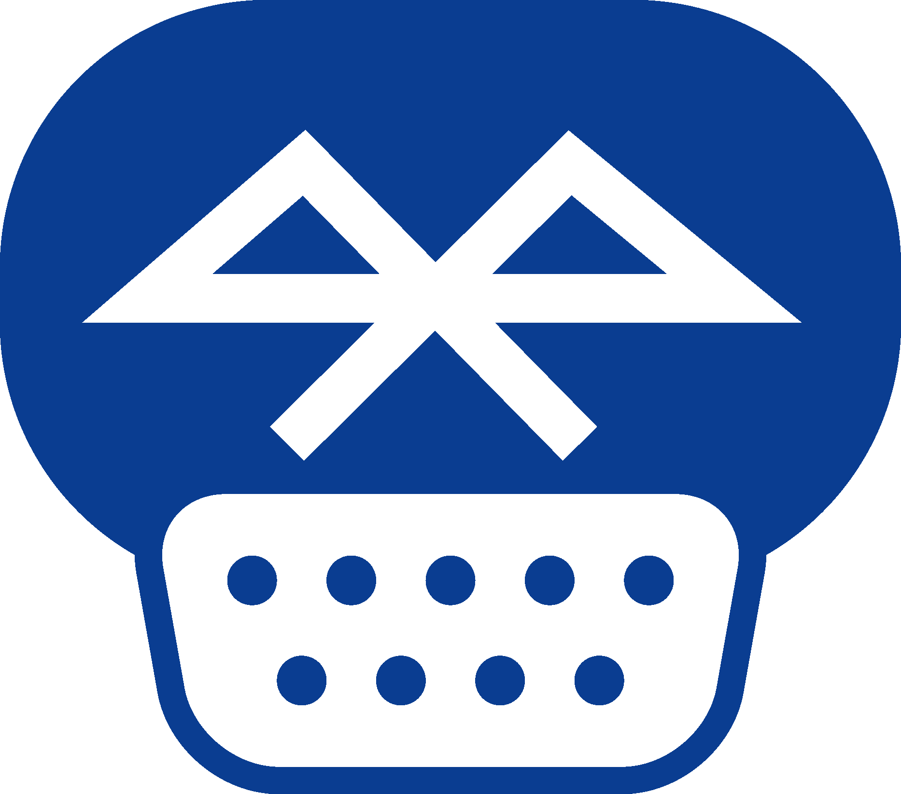

# Bluetooth controller adapter for MSX (msx-joyblue) v1

Connect Bluetooth controllers to [MSX computers](https://www.msx.org/wiki/)

> [!WARNING]
> This is a work in progress project.
>
> An adapter based on PCB version 1a has been successfully built and tested using the bluepad32 firmware (develop branch)!
>
> The proposed acrylic enclosure with the latest modifications has NOT yet been tested! Nearly there!
>

## Introduction

The msx-joyblue is an adapter that allows connecting Bluetooth controllers to [MSX general purpose ports](https://www.msx.org/wiki/General_Purpose_port).

The adapter is based on the [unijoysticle2](https://github.com/ricardoquesada/unijoysticle2) and [bluepad32](https://github.com/ricardoquesada/bluepad32) projects, both owned by Ricardo Quesada.

The main features of the msx-joyblue v1 adapter are:
* small size
* made of widely available electronic components
* uses easy to solder through-hole components to lower the skills needed to build the adapter
* emulates up to two MSX joysticks
* attaches to MSX computers using female standard DE9 connectors
* formally requires an external USB power supply as the adapter draws slightly more current than two MSX ports can officially provide
* optionally, can be powered using MSX general purpose ports without an external power supply if your MSX can safely supply enough current
* builtin leds provide information about the operation of the adapter

## [Hardware](hardware/kicad/)

The msx-joyblue v1 adapter uses an ESP32-WROOM-32E based development board (either a [ESP32-DevKitC-32E](https://www.espressif.com/en/products/devkits/esp32-devkitc) board or a [NodeMCU-32 V1.3](docs/NodeMCU32-S_specification_V1.3.pdf) board) to convert the Bluetooth controller actions to the [MSX joystick standard signalling](https://www.msx.org/wiki/Joystick_control).

A printed circuit board (PCB) is used to easily bind all components:
* The ESP32 adapter board is connected using female headers
* PH2.0 connectors are used to connect cable extensions
* A 2.54 pitch I2C header is added for future extensions
* Jumpers are provided to enable different power options
* Only through-hole components are used

Connection to the MSX general purpose ports is implemented using a DE9 joystick extension cables with a female DE9 connector on one side and a loose end on the other side.
The MSX joystick extension cable loose end is wired according to the following pinout mapping.

|  |
|:--|
| MSX joystick connector pinout, from controller plug side |

| MSX side pin | Cable color (may vary) | Signal |
| ------------ | ---------------------- | ------ |
| 5            | Brown                  | +5v    |
| 4            | Orange                 | RIGHT  |
| 3            | Grey                   | LEFT   |
| 2            | Black                  | DOWN   |
| 1            | Red                    | UP     |
| 6            | Green                  | TRIG1  |
| 7            | White                  | TRIG2  |
| 8            | Blue                   | STROBE |
| 9            | Yellow                 | GND    |

### Build1

The Build1 adapter ignores the MSX general purpose pin8 (OUT) signal. This is not a problem in general, but can cause incompatibilities with specific software, like MSX-HID [^2], which uses pin8 to try to guess which kind of device is connected to a MSX general purpose port. For MSX-HID, holding the Trigger B button, will put the software in FM-Towns compatible mode which will make the adapter functional.

This build uses open collector outputs (via [74LS05 hex inverters with open collector outputs](https://www.ti.com/lit/ds/symlink/sn7405.pdf)) which makes the adapter safer [^3] than the standard MSX joystick schematic depicted in the MSX Technical Data Book, as it avoids a series of undesired conditions that can lead to bus contention/short circuits.

||
|:--|
|msx-joyblue-v1 Build1a without case|

## [Firmware](https://github.com/ricardoquesada/bluepad32/tree/develop)

The msx-joyblue v1 adapter firmware uses Ricardo Quesada [bluepad32](https://github.com/ricardoquesada/bluepad32/tree/develop) library to drive Bluetooth controllers.
A [small modification](https://github.com/ricardoquesada/bluepad32/commit/9736bd169bc13ec625d469b8305d2ed2f46d6e69) to the library that enables support for MSX computers has been already commited to the _develop_ branch.

See [bluepad32 documentation](https://github.com/ricardoquesada/bluepad32/tree/main/docs) for [supported Bluetooth controllers](https://github.com/ricardoquesada/bluepad32/blob/main/docs/supported_gamepads.md).

## [Enclosure](enclosure/)

A simple acrylic enclosure is included (but do not laser cut it yet, it requires minor adjustments for the buttons cutout).

||
|:--|
|msx-joyblue-v1 Build1a inside case prototype|

## Powering the msx-joyblue adapter

The msx-joyblue adapter uses about ~107mA when operating, while a single MSX general purpose port is capable of delivering up to 50mA according to the MSX standard [^1].
That means that even using two MSX general purpose ports (50mA + 50mA = 100mA) we are slightly over (107mA) the max current specification for the MSX general purpose ports.

Thus, the safest way to power the msx-joyblue adapter is by powering it via the USB micro connector of the attached ESP32 board using an external 5V USB power supply. The board automatically powers up when using the USB micro connector without enabling any switch.

Nevertheless, even if the MSX especification puts such a low limit on the current that can be drawn from a general purpose port, real MSX hardware usually can safely deliver enough current for the msx-joyblue adapter to work correctly without harming our beloved classic computers.

Taking that into account, the msx-joyblue adapter has been enabled to be optionally powered by the MSX general purpose ports port A and port B.

To enable powering the msx-joyblue adapter from port A and/or port B, the switch J3 _JOY PWR_ must be first turned on by sliding the switch handle to the right.

> [!NOTE]
> A [1N5817 Schottky diode](https://www.onsemi.com/download/data-sheet/pdf/1n5817-d.pdf) D1 is used to avoid leaking current from the msx-joyblue adapter to the MSX in case the msx-joyblue adapter is powered by USB.
> And two Positive Temperature Coeficient (PTC) resettable fuses F3 and F4 of 50mA each protect the MSX general purpose ports port A and port B from excess of current in case something goes horribly wrong on the msx-joyblue adapter side, aligning to the MSX specification.

To power the msx-joyblue adapter using the MSX general purpose ports we must first understand how the PTC protections on the msx-joyblue adapter are implemented.

The selected PTCs are rated for 50mA which is the so called Hold Current (the maximum current that can flow in normal operation). There is also the Trip Current (the minimum current necessary for the PTC to move to high-resistance state) which for the selected PTCs is around 100mA. Those thresholds are dependent on temperature and voltage. And to make things more undeterministic, the behaviour of the PTC when current is between those thresholds is undefined (it may trip or not).

In normal operation and for a room temperature of around 25 degrees Celsius, the selected PTCs in practice never trip below 75mA.

So **if our MSX computer can safely provide more than 50mA on each MSX general purpose port** (which is usually the case), we can connect both Port A and port B to the MSX computer and turn on the J3 _JOY PWR_ switch to power the msx-joyblue adapter. Note that we need to connect both ports even if we use just one Bluetooth gamepad, just to meet the power requirements.

From PCB board version 1a, two jumpers JP3 and JP4 can be used to bypass the PTC protections for port A and port B.

> [!WARNING]
> Bypassing the PTC protections may damage your MSX computer.
> Do not bypass the PTC protections unless you known what you are doing.

By closing JP3 (and/or JP4) and **if our MSX computer can safely provide more than 100mA on a single MSX general purpose port**, we can connect Port A (or Port B) to the MSX computer and turn on the J3 _JOY PWR_ switch to power the msx-joyblue adapter using a single joystick port.

In summary, we can use the following options to power the msx-joyblue adapter (from safest to less safe):
* via the ESP32 USB micro conector
  * leave open jumpers J3 and J4
  * turn off the J3 _JOY PWR_ switch
  * connect a 5V USB power supply to the ESP32 USB micro connector
* via two MSX general purpose ports, if your MSX can safely provide slightly more than 50mA on each MSX general purpose port
  * leave open jumpers J3 and J4
  * turn on the J3 _JOY PWR_ switch
  * connect both Port A and Port B to the MSX general purpose ports
* via one MSX general port, if your MSX can safely provide more than 100mA on each MSX general purpose port
  * close jumpers J3 and/or J4
  * turn on the J3 _JOY PWR_ switch
  * connect Port A or Port B to a MSX general purpose port

## Compatibility Tests

| **Model**                | **Adapter PCB v1 Build1a** |
|--------------------------|----------------------------|
| Sony MSX HB-101P         |          OK                |
| Sony MSX HB-501F         |          OK                |
| Toshiba MSX HX-10        |          OK                |
| Philips MSX2 VG-8235     |          OK                |
| Panasonic MSX2+ FS-A1WSX |          OK                |
| Omega MSX2+              |          OK                |
| MSXVR                    |          OK                |

## References

Ricardo Quesada bluepad32 library
* https://github.com/ricardoquesada/bluepad32

Ricardo Quesada Unijoysticle2 project
* https://github.com/ricardoquesada/unijoysticle2

MSX General Purpose port
* https://www.msx.org/wiki/General_Purpose_port

[^1]: https://www.msx.org/wiki/General_Purpose_port
[^2]: https://www.msx.org/wiki/MSX-HID
[^3]: https://www.msx.org/wiki/Joystick/joypad_controller (see "Undesired Conditions")

## Image Sources

* https://www.oshwa.org/open-source-hardware-logo/
* https://en.wikipedia.org/wiki/File:Numbered_DE9_Diagram.svg
* https://commons.wikimedia.org/wiki/File:Bluetooth.svg
