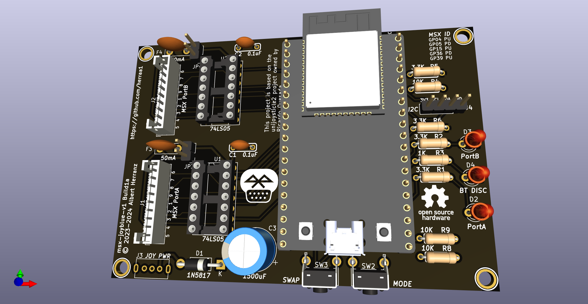

# Bluetooth controller adapter for MSX (msx-joyblue) v1

Connect Bluetooth controllers to [MSX computers](https://www.msx.org/wiki/)

> [!WARNING]
> This is a work in progress project.
> The firmware is working and a breadboard-based prototype has been validated, but no PCB has been built yet.

## Introduction

The msx-joyblue is an adapter that allows connecting Bluetooth controllers to [MSX general purpose ports](https://www.msx.org/wiki/General_Purpose_port).

The adapter is based on the [unijoysticle2](https://github.com/ricardoquesada/unijoysticle2) and [bluepad32](https://github.com/ricardoquesada/bluepad32) projects, both owned by Ricardo Quesada.

The main features of the msx-joyblue v1 adapter are:
* small size
* made of widely available electronic components
* uses easy to solder through-hole components to lower the skills needed to build the adapter
* emulates up to two MSX joysticks
* attaches to MSX computers using female standard DE9 connectors
* formally requires an external USB power supply as the adapter draws slightly more current than two MSX ports can officially provide
* builtin leds provide information about the operation of the adapter

## [Hardware](hardware/kicad/)

The msx-joyblue v1 adapter uses an [ESP32-DevKitC-32E](https://www.espressif.com/en/products/devkits/esp32-devkitc) to convert the Bluetooth controller actions to the [MSX joystick standard signalling](https://www.msx.org/wiki/Joystick_control).

A printed circuit board (PCB) is used to easily bind all components:
* The ESP32 is connected using female headers
* PH2.0 connectors are used to connect cable extensions
* A 2.54 pitch I2C header is added for future extensions
* Only through-hole components are used

Connection to the MSX general purpose ports is implemented using a DE9 joystick extension cables with a female DE9 connector on one side and a loose end on the other side.
The MSX joystick extension cable loose end is wired according to the following pinout mapping.

|  |
|:--|
| MSX joystick connector pinout, from controller plug side |

| MSX side pin | Cable color (may vary) | Signal |
| ------------ | ---------------------- | ------ |
| 5            | Brown                  | +5v    |
| 4            | Orange                 | RIGHT  |
| 3            | Grey                   | LEFT   |
| 2            | Black                  | DOWN   |
| 1            | Red                    | UP     |
| 6            | Green                  | TRIG1  |
| 7            | White                  | TRIG2  |
| 8            | Blue                   | STROBE |
| 9            | Yellow                 | GND    |

## [Firmware](https://github.com/ricardoquesada/bluepad32/tree/develop)

The msx-joyblue v1 adapter firmware uses a [small modification](https://github.com/herraa1/bluepad32/commits/topic/develop-unijoysticle-msx/) of Ricardo Quesada [bluepad32](https://github.com/ricardoquesada/bluepad32/tree/develop) library to drive Bluetooth controllers.

See [bluepad32 documentation](https://github.com/ricardoquesada/bluepad32/tree/main/docs) for [supported Bluetooth controllers](https://github.com/ricardoquesada/bluepad32/blob/main/docs/supported_gamepads.md).

## References

Ricardo Quesada bluepad32 library
* https://github.com/ricardoquesada/bluepad32

Ricardo Quesada Unijoysticle2 project
* https://github.com/ricardoquesada/unijoysticle2

MSX General Purpose port
* https://www.msx.org/wiki/General_Purpose_port

## Image Sources

* https://www.oshwa.org/open-source-hardware-logo/
* https://en.wikipedia.org/wiki/File:Numbered_DE9_Diagram.svg
* https://commons.wikimedia.org/wiki/File:Bluetooth.svg
